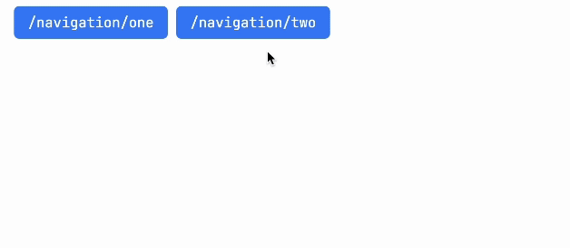

# Animation Interpolator
I created this codebase primarily to learn how to interpolate certain nodes across different UIs.

## Inspiration
I was primarily interested in the ViewTransitions API, and the idea of the `Hero` widget in Flutter. I wrote a library that would
manually transition the positions of elements that were shared across two routes.

## Latest Version
I first wrote a version that worked only when the state was updated through SvelteKit. But i found that very limiting in it's application.

So I wrote a second version that also worked across navigation. This worked by setting the same `data-hero-key` attribute on two routes.
If two nodes with the same key were found on two separate routes, the code would interpolate the positions by setting them absolute.

The latest version is a more cleaned up version that also allowed for a `data-hero-transition` to be set to any css transition like `scale` or `opacity`
that would be applied to the element.

## Extra
I tried using elk.js and cytoscape to create a graph as a complicated example of how nodes could be transitioned across routes.

# Demonstration
Run `pnpm run dev` and visit `localhost:5173`

At `/`, a grid will be shown where the user can press `Swap` to animate the elements swapping randomly in position

At `/graph`, a set of nodes, each with a set of neighbors will be shown. The user can press a specific node and that node
will move to the center, with all other neighbors in a circle around it. The positions animate

At `/navigation`, two buttons to navigate between two routes will be shown. You can navigate between routes to interpolate

## Using the library
You must wrap the DOM you would like to animate with a `Hero` widget. This Hero widget has a unique `id` which allows you to
have multiple separate Hero widgets. This id must be unique and is what identifies the scope.

Each element you would like to animate must have a unique `data-hero-key` attribute that is the same across different routes/state updates.
You can also optionally set a `data-hero-transition` attribute to animate css transitions like `scale` or `opacity`. See `routes/**/*.svelte` for examples.